# Cohort Analysis — Анализ рекламных кампаний и поведения пользователей
## О проекте
Cohort Analysis — проект посвящён анализу эффективности рекламных кампаний, конверсии пользователей и их удержанию на основе данных о событиях в мобильном приложении. Основная цель — создание интерактивного дашборда в Power BI и предварительный анализ данных в Python.

## Возможности
- **Анализ выручки по каналам привлечения** — выявление самых прибыльных рекламных кампаний
- **Когортный анализ** — расчёт удержания пользователей по неделям с построением матрицы удержания (retention matrix)
- **Анализ конверсии** — расчёт конверсии между ключевыми событиями
- **Время между событиями** — анализ задержек между действиями пользователей
- **Интерактивный дашборд в Power BI** — визуализация KPI (выручка по каналам, конверсия и т.д.)
- **Предварительный анализ данных (EDA)** — статистика по событиям, группировки, распределения

## Работа с данными:
- **Источник данных** — CSV-файл с событиями мобильного приложения (190к+ уникальных пользователя, 3 месяца данных)
- **Обработка в Python (pandas)**:
  - Предварительный просмотр и очистка данных
  - Расчёт базовых метрик (общая выручка, средний чек, количество покупок)
  - Группировка и агрегация по каналам, ОС, полу, городам
  - Создание когортной матрицы удержания
  - Расчёт конверсионной воронки и времени между событиями
- **Визуализация в Python (matplotlib + seaborn)** — гистограммы, тепловые карты когорт, диаграммы
- **Итоговая визуализация в Power BI** — построение интерактивного дашборда с карточками KPI, матрицами, графиками выручки и фильтрами

## Аналитические способности:
- Анализ эффективности 7 рекламных каналов (выручка, доля в общей выручке, средний чек)
- Когортный анализ удержания пользователей
- Конверсионная воронка от установки до покупки
- Анализ времени между событиями 
- Сравнение метрик по ОС (android / ios), полу и городам

## Ключевые выводы
- Средний чек — 709 ₽
- Самый прибыльный канал среди известных — vk_ads (>16% выручки)
- Конверсия в покупку от запуска приложения — 37%
- Удержание пользователей на 2-й неделе — ~37%

## Технологии
- **Python** 3.11+
- **pandas** >= 2.0.0
- **matplotlib** >= 3.5.0
- **seaborn** ≥ 0.12.0
- **Power BI** Desktop (бесплатная версия)
- **Формат данных** — CSV, Excel


## Технические детали:
### Визуализация использует:
- **Power BI Desktop** — основной инструмент для построения интерактивного дашборда 
- **Matplotlib + Seaborn (Python)** — дополнительная визуализация для предварительного анализа и технической документации

## Результат:
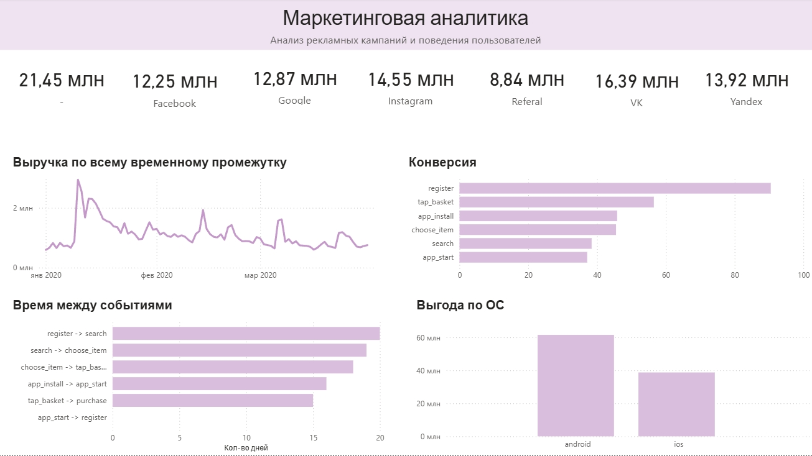
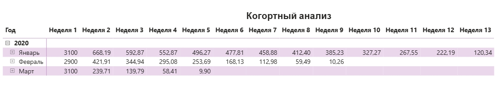
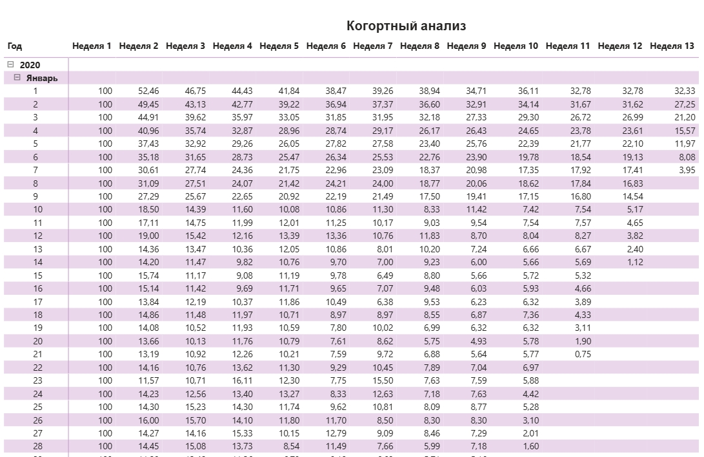

## Выгрузка агрегированных данных

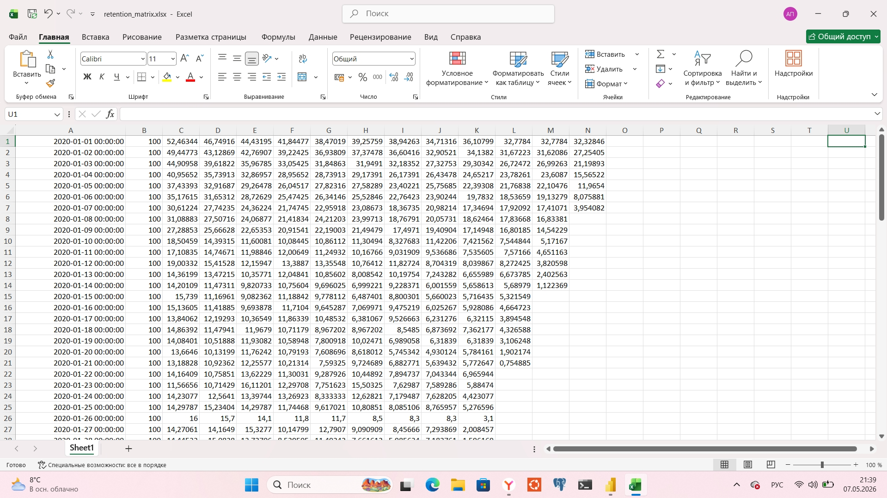

## Предварительный анализ в консоли Python:
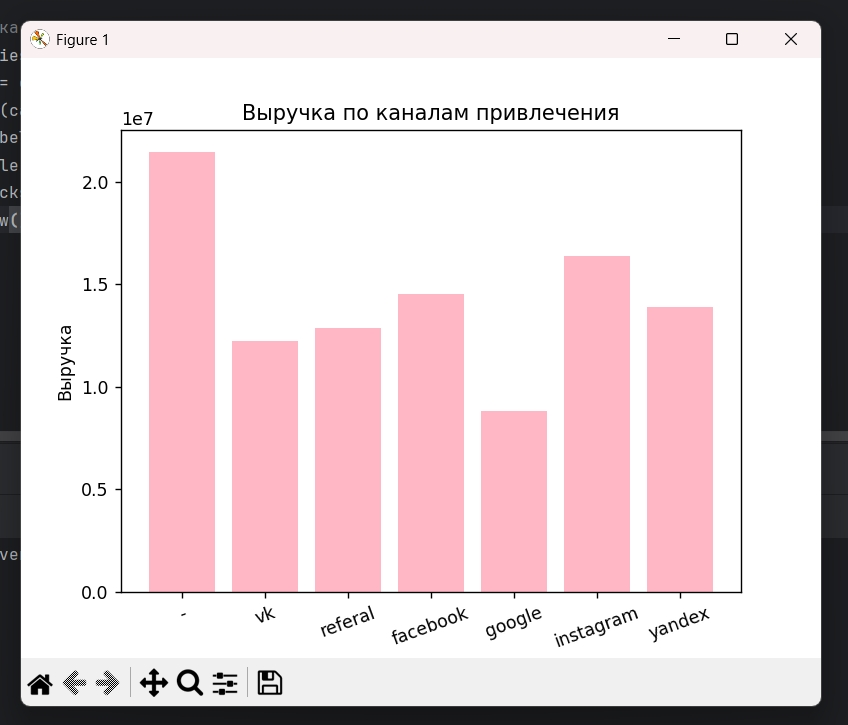
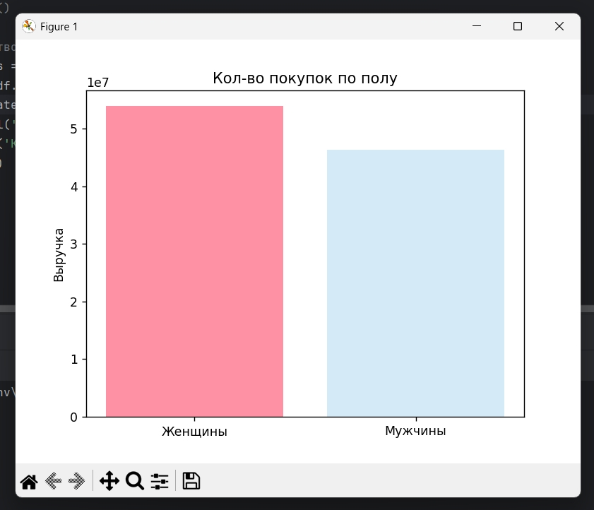
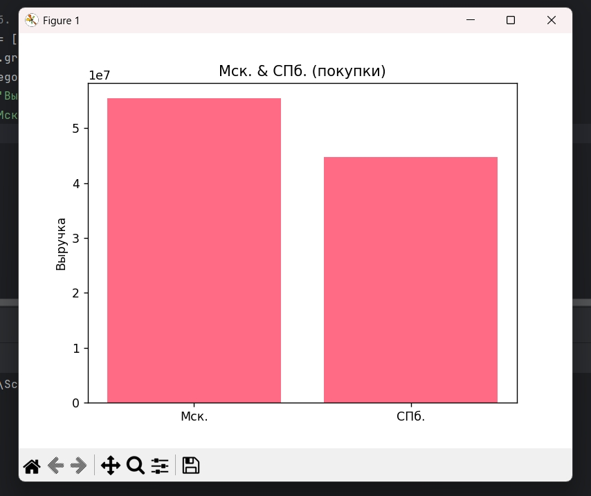
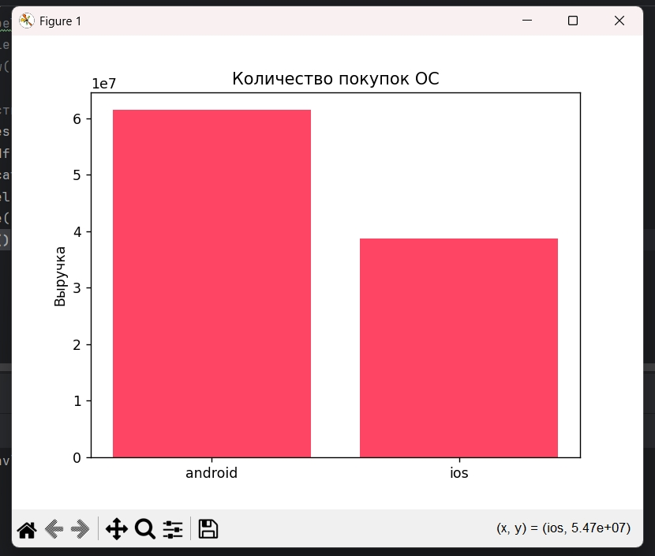
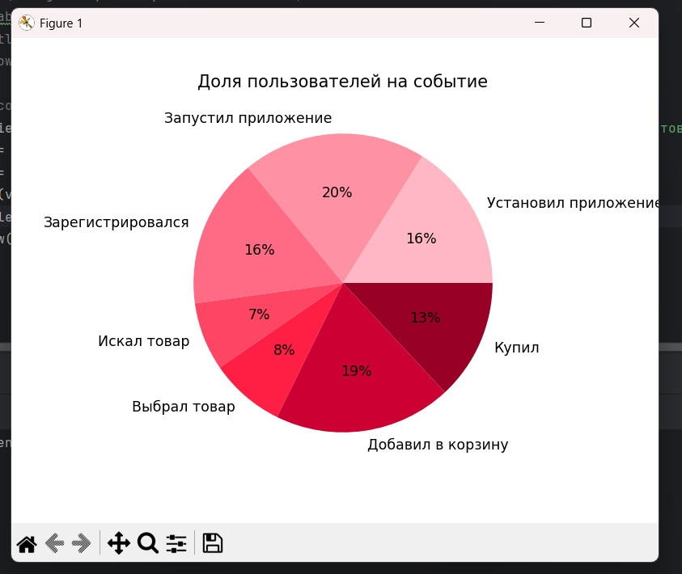
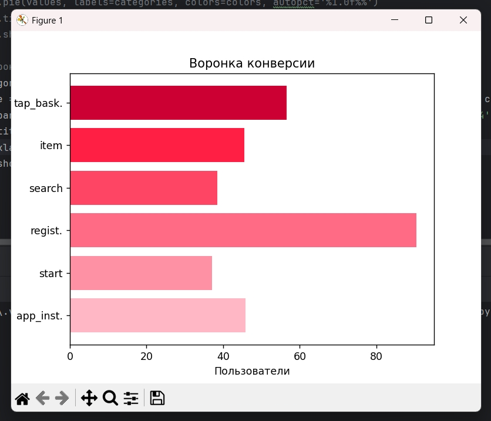
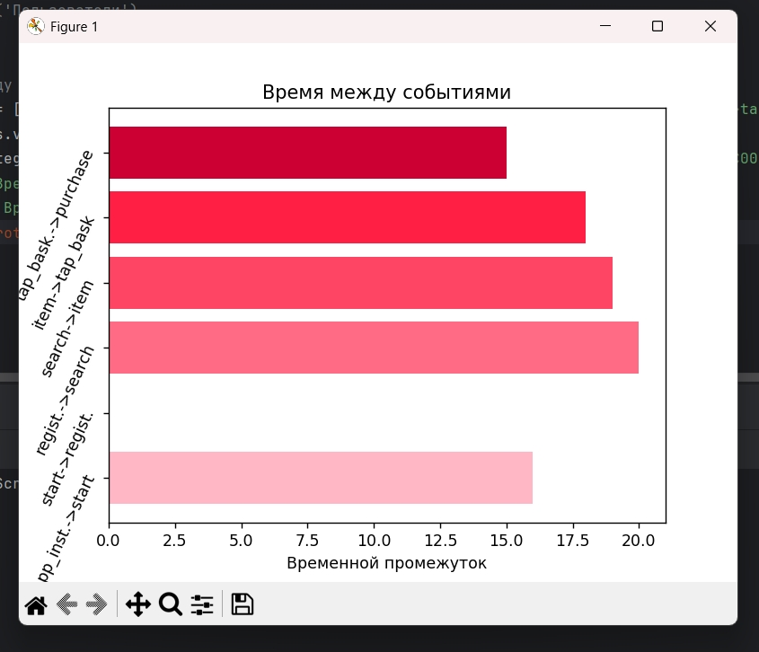
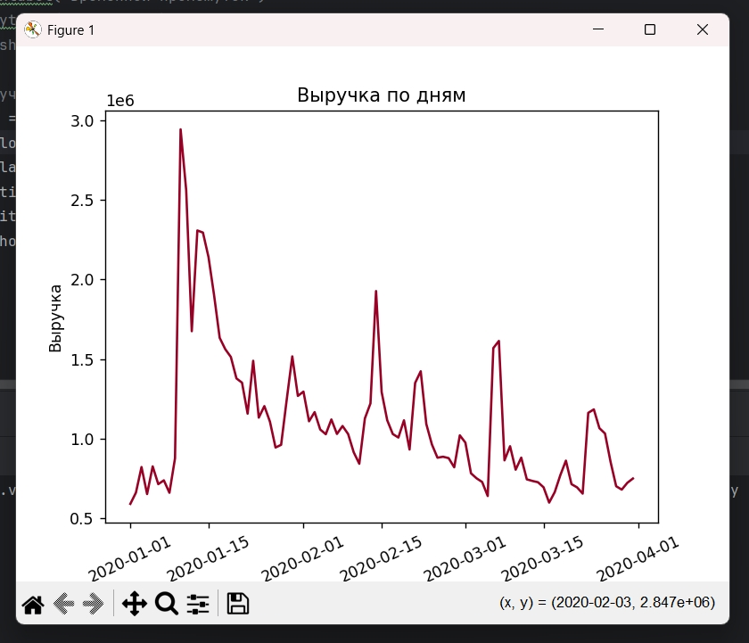
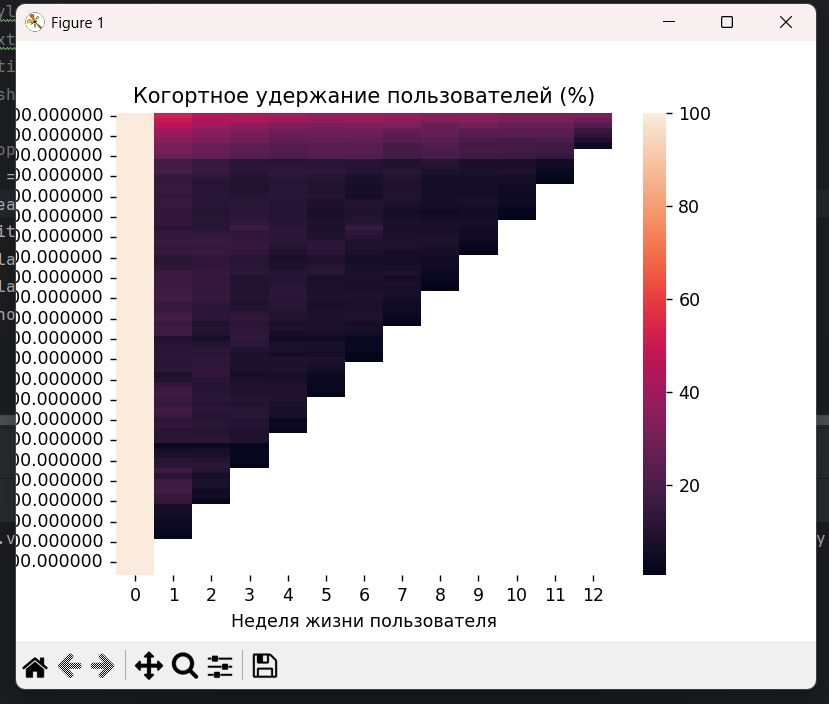

## Установка и запуск

***Клонирование проекта:***
```
git clone https://github.com/Anastasia-0-Iva/Cohort-analysis.git
cd Cohort-analysis
```

***Создание виртуального окружения:***
```
# Windows
python -m venv venv
.\venv\Scripts\activate

# Linux/macOS
python3 -m venv venv
source venv/bin/activate
```

***Установка зависимостей:***
```
poetry install
```